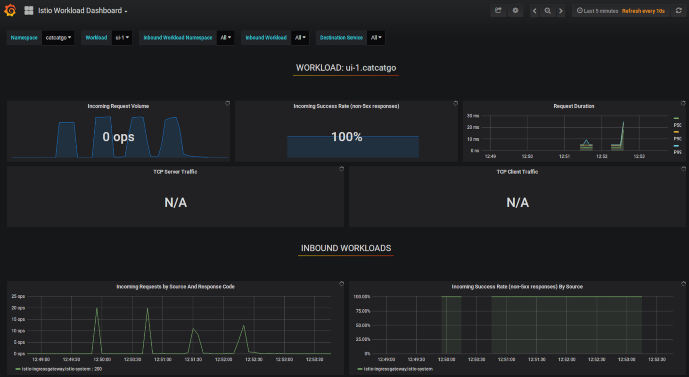
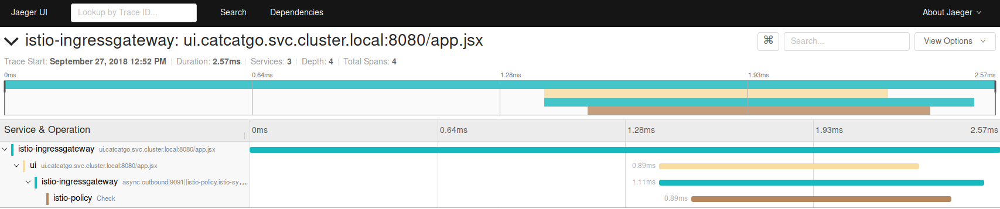
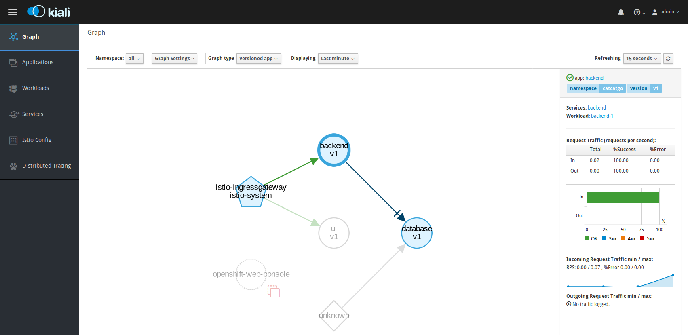

# Istio
## Intro into service mesh

Vadim Rutkovsky <vrutkovs@redhat.com>

---
### So you've installed Kubernetes

All the cool kids do this these days,

but what about my app?

* Why is it taking so long to process a request?
* What's the performance of my services?
* How many 404/5xx errors are my users seeing?
* How do I rollout the new version just for a fraction of users?
* How do my services connect to each other?

---
### Istio

An open platform to connect, manage, and secure microservices.
https://istio.sh

* Developed by Google, IBM, and Lyft
* **Sidecar pattern** - every pod gets Envoy proxy, which additionally filters traffic
* CRD-based, controlled by `kubectl` commands

---
### Istio - advanced features

* Flexible routing rules - e.g. cookie-based
* Ingress/Egress traffic rules
* **Circuit breaking** - drop slow requests sooner
* **Traffic shifting** - split traffic between services
* **Mirroring** - copy existing traffic to not-yet-available version of the app
* **TLS between pods** - in-cluster security

---


---
### Istio - additional services

* **Zipkin**, **Jaeger** - tracing requests
* **Prometheus+Grafana** - metrics
* **ServiceGraph**, **Kiali** - render service status as a graph

---
### Gateway
`Gateway` - Istio custom resource which manages ingress

---
### DestinationRule
`DestinationRule` - Istio CR to select pods based on app/version/etc.

* Splits services in subsets (e.g. versioned service) and routes them to the gateway
* Sets matching for endpoints (e.g. route `/api/v1` to v1 pods and `/api/v2` to v2)

---
### DestinationRules tricks

* Endpoint matching:
  - URL-based
  - header-based
  - cookie-based
* Split traffic between endpoints services by weight
---
#### Metrics



---
#### Tracing requests
Jaeger UI - a tool to trace requests



---
#### Mesh Overview

Kiali - a tool to visualize the mesh



---
### Enforced TLS between services

Istio can enforce TLS between pods, which ensures security in hybrid clouds and
enable authentication between deployed services.

---
### Fault injection
Test app behaviour during realistic network conditions:

* Occasional http errors - e.g. throw 500 error on 75% requests
* Response delay - e.g. 50% of responses would have 5s delay

---
### Limit incoming requests

Envoy allows rate-limiting TCP or HTTP connections and either queue those
or throw HTTP 503 error
---
### Traffic Mirroring

Given 2 versions of the app, having `v1` point to production and `v2` not connected,
Istio allows mirroring traffic from `v1` to `v2` endpoint.

This enables developers to check the behaviour of not yet deployed service on production
using 'real' traffic.

---
### Getting Started
Download Istio tarball from https://github.com/istio/istio/releases/

Setup Istio with service-to-service auth:
```
$ kubectl apply -f install/kubernetes/istio-demo-auth.yaml
```
OR without auth:
```
$ kubectl apply -f install/kubernetes/istio-demo.yaml
```

---
### Demo

**CatCatGo** - search engine for Reddit cat pictures.

* Database - MongoDB
* Backend - python aiohttp

  responds to 'api/v1.0/search/kitten'
* Frontend - ReactJS app
* (hidden) CronJob to scrape fresh cat pictures from several subreddits and fill DB in

https://catcatgo.cloud.vrutkovs.eu

---
### Demo - canary deployment for some users

---
### Demo - monitoring

---
### Demo - fault injection

---
# Questions?

Slides: https://vrutkovs.github.io/slides-istio-intro
Code: https://github.com/vrutkovs/catcatgo

*<!-- -->* vrutkovs  <!-- .element: class="fab fa-github-square" -->

*<!-- -->* vrutkovs  <!-- .element: class="fab fa-twitter-square" -->

*<!-- -->* vrutkovs@redhat.com  <!-- .element: class="fas fa-envelope-square" -->
